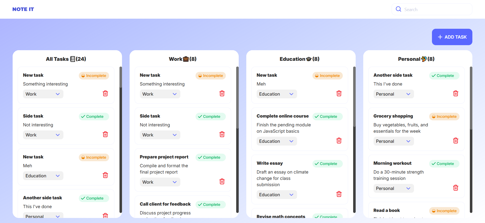
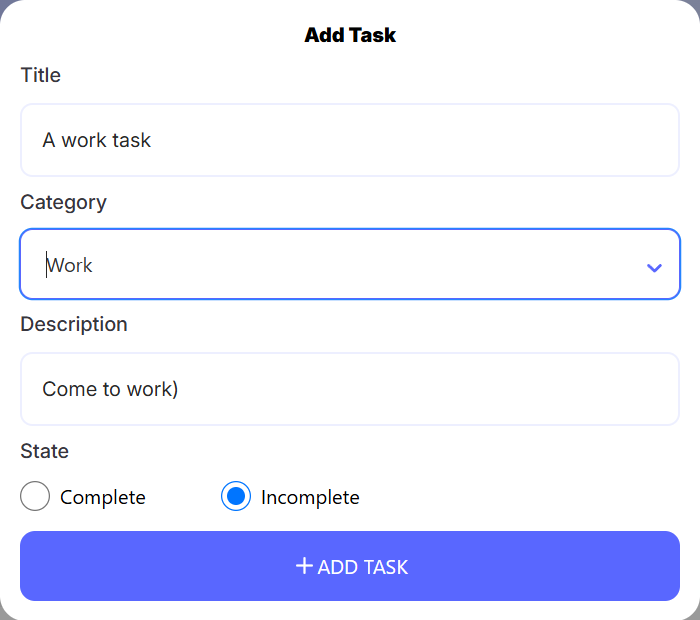
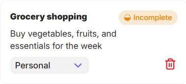
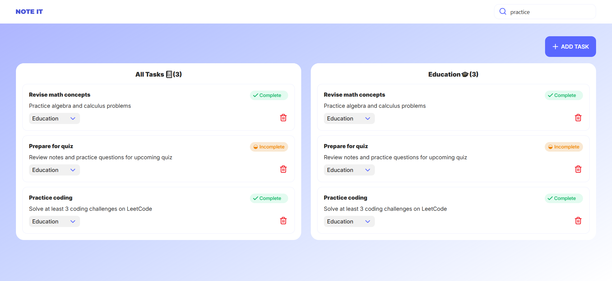

# Note It Task Manager

## Built with
- React + Vite + TypeScript 💻
- TailwindCSS 🎨
- React hook form 🔗
- React select 📝
- Yup validation ✅

## Live demo
[Note It Demo](https://bymajka.github.io/react-tasks/)

## How works
1. Clone this project: `git clone https://github.com/bymajka/react-tasks.git`
2. Once you have cloned this project, you can install the required dependencies by using: `npm install`
3. Run project with script: `npm run dev`

## Functions
### Creation of new Task  

### Removing task from task list / changing status or category of task  

### Filtration of Tasks with searchbar

